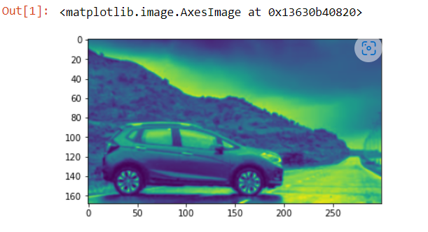
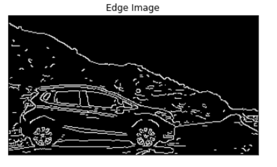
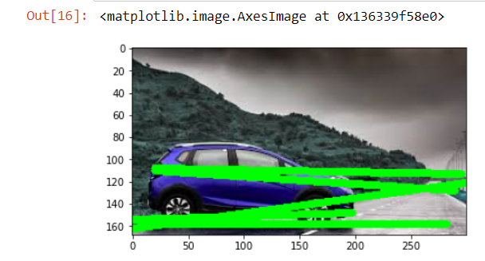

# Edge-Linking-using-Hough-Transform
## Aim:
To write a Python program to detect the lines using Hough Transform.

## Software Required:
Anaconda - Python 3.7

## Algorithm:
### Step1:
Import all the necessary Python libraries which are required for the program.
<br>

### Step2:
Load a image using imread() from cv2 module.
<br>

### Step3:
Convert the image to grayscale.
<br>

### Step4:
Using Canny operator from cv2,detect the edges of the image
<br>

### Step5:
Using the HoughLinesP(),detect line co-ordinates for every points in the images.Using For loop,draw the lines on the found co-ordinates.Display the image.
<br>


## Program:
```Python
Done by : JEEVA MS

Reg.No : 212221230040

# Read image and convert it to grayscale image
import cv2
import matplotlib.pylab as plt
import numpy as np
img=cv2.imread("images.jfif")
plt.imshow(img)
grayscale=cv2.cvtColor(img,cv2.COLOR_BGR2GRAY)
gaussian_blur=cv2.GaussianBlur(grayscale,(3,3),0)
plt.imshow(gaussian_blur)


# Find the edges in the image using canny detector and display
canny_edges = cv2.Canny(gaussian_blur, 120, 150)
plt.imshow(canny_edges,cmap='gray')
plt.title('Edge Image'),plt.xticks([]),plt.yticks([])
plt.show()


# Detect points that form a line using HoughLinesP

lines=cv2.HoughLinesP(canny_edges,1,np.pi/180,threshold=80,minLineLength=10,maxLineGap=250)

# Draw lines on the image

for line in lines:
    x1,y1,x2,y2=line[0]
    cv2.line(img,(x1,y1),(x2,y2),(0,255,0),1)

# Display the result
plt.imshow(img,'gray')


```
## Output

### Input image and grayscale image

<br>
<br>
<br>
<br>

### Canny Edge detector output

<br>
<br>
<br>
<br>


### Display the result of Hough transform

<br>
<br>
<br>
<br>


## Result:
Thus the program is written with python and OpenCV to detect lines using Hough transform. 
